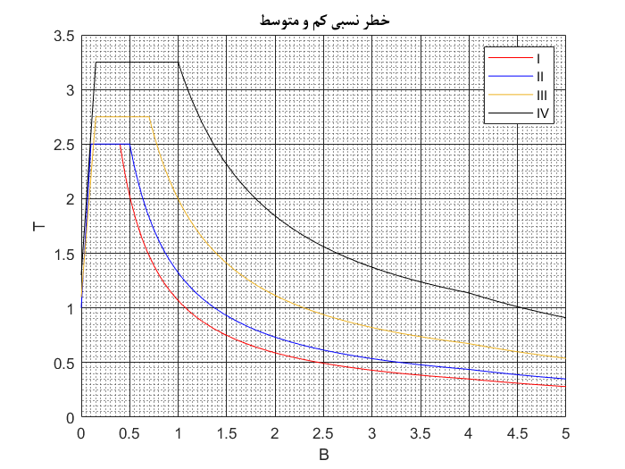
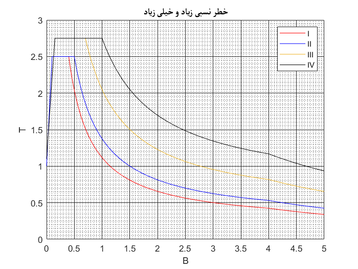

# Standard Spectrum Response of Iran's seismic code 2400 R4
This is a High-Res Standard Spectrum Response of Iran's seismic code. It makes base shear calculations agile.

  

  

## License
Licensed under the [GNU General Public License, Version 3](LICENSE).
